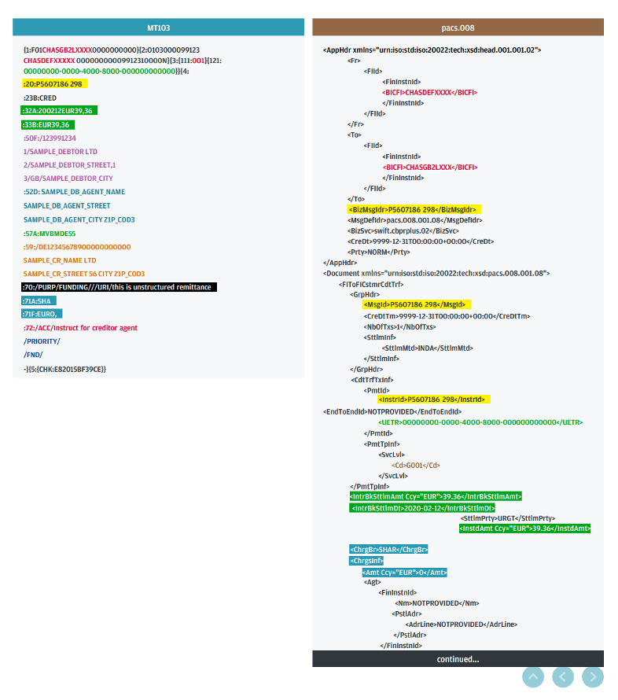
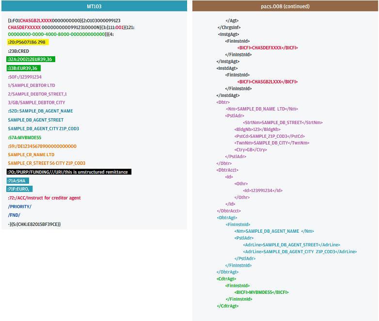
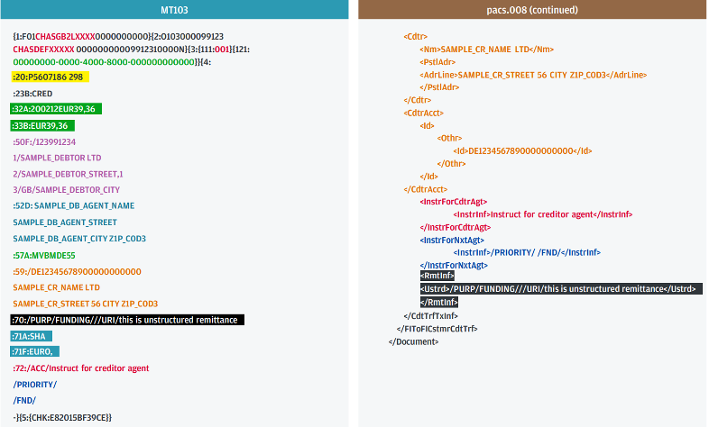
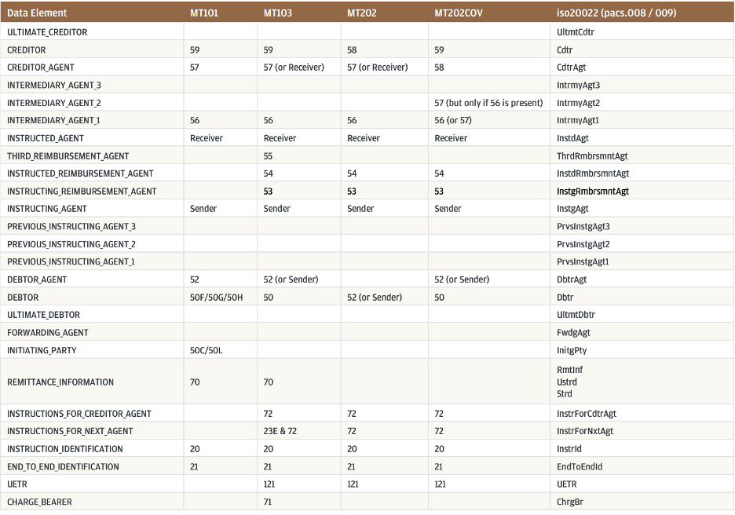

# 
SPÉCIFICATION FONCTIONNELLE

## 
Transformation MT103 Vers PACS.008

### 
Rédigée par Salma Yousry

### 
Présentée à Mr. Yassine El Ghazouani, Mr. Anas Dbichi

#### 
7 juillet 2025, Attijariwafa Bank

### Objectif
Cette spécification décrit les règles de transformation permettant de convertir un message SWIFT MT103 en un message ISO 20022 PACS.008, selon les directives de la norme CBPR+ définie par SWIFT. Elle vise à garantir la conformité structurelle et fonctionnelle des messages dans le cadre des paiements transfrontaliers interbancaires.

### Contexte
* MT103 : message SWIFT utilisé pour les virements client à client.
* PACS.008 : message ISO 20022 destiné aux mêmes opérations, avec un format XML plus détaillé.
* CBPR+ : cadre imposant des contraintes spécifiques sur les champs utilisés dans le pacs.008 pour les paiements internationaux via SWIFT.

### Transformation MT103 à pacs.008
La transformation d’un message MT103 en pacs.008 repose sur la lecture d’un message texte structuré 
(selon les balises :20:, :32A:, :50K:, etc.) et la génération d’un fichier XML conforme à la norme ISO 20022, avec la 
variante CBPR+. Le message ciblé respecte une structure XML, divisée en trois niveaux principaux : le nœud racine <Document>,
le bloc fonctionnel <FIToFICstmrCdtTrf> (Financial Institution to Financial institution Costumer Credit Transfer), et les sous-blocs comme:
+ `<GrpHdr>` (Group Header), bloc avec les informations globales du message:
    + `<MsgId>` = Message ID =  :20: dans MT103
    + `<CreDtTm>` = Creation Date Time	  
    + `<NbOfTxs>` = Number of Transactions
    + `<SttlmInf>` = Settlement Information
+ `<CdtTrfTxInf>` (Credit Transfer Transaction Information), décrit chaque paiement:
    
    + `<PmtId>` = Payment Identification
    + `<InstrId>` = Instruction ID
    + `<EndToEndId>` = End-to-End Reference
    + `<Amt>` = Amount
      
      + `<InstdAmt Ccy="EUR">1234.56</InstdAmt>` = Instructed Amount
      + `<Dbtr>` = Debtor (le client qui paie, :50K:)

        + `<Nm>` = Name
        + `<PstlAdr>` = Postal Address
      + `<Cdtr>` = Creditor (le client qui reçoit, :59:) 
        
        + même que Dbtr
      + `<ChrgBr>` = Charge Bearer (qui paie les frais,  :71A:)

Par exemple, la balise :20: du MT103 (référence de transaction) devient la valeur du champ XML <MsgId> dans le bloc `<GrpHdr>`. 
Le champ :32A: qui contient une date, une devise et un montant collés doit être parsé et séparé en trois balises : `<IntrBkSttlmDt>`,
`<InstdAmtCcy="EUR">12345.67</InstdAmt>`.
Les blocs texte :50K: (donneur d’ordre) et :59: (bénéficiaire), qui contiennent nom et adresse sur plusieurs lignes, 
doivent être interprétés et restructurés dans les balises `<Dbtr>` et `<Cdtr>`, avec sous-balises `<Nm>`, `<PstlAdr>`, `<Ctry>`, etc.

Côté technique, la transformation peut être implémentée comme :
+ une fonction de parsing ligne par ligne du message MT103 (reconnaître les tags :xx:)
+ une table de correspondance (mapping) qui relie chaque tag à un champ XML cible
+ une étape de nettoyage / enrichissement pour les champs manquants
+ et enfin une génération du fichier XML à l’aide d’un outil (comme une lib JAXB).

CBPR+ impose des règles strictes : par exemple, si un BIC est utilisé pour identifier une banque, il ne faut pas inclure
son nom et adresse dans la même balise. Certains champs doivent être exclus (ex: RmtInf/Ustrd) ou imposent des formats précis 
(comme la structure d’adresse). Il faut aussi s’assurer que le message généré soit bien valide XML et conforme au schéma XSD 
officiel fourni par SWIFT.

Certaines règles CBPR+ Usage Guidelines:
+ Un seul transfert par message : chaque pacs.008 doit contenir exactement une transaction  
+ Identification des agents bancaires (Debtor Agent, Creditor Agent, Intermediary Agent) : l’usage d’un BICFI est fortement recommandé, voire obligatoire selon CBPR+.
L’utilisation d’un nom et adresse seule peut entraîner des ralentissements opérationnels ou coûts
+ Si BICFI est présent dans un élément d’agent, le nom et l’adresse ne doivent pas être utilisés pour éviter les conflits ; BICFI l’emporte
+ Pour l’élément `<ChrgBr>` (répartition des frais), le format CBPR+ impose une seule occurrence, notamment dans le cas du code DEBT
  + Les adresses postales doivent être aussi structurées que possible, préférant des balises dédiées (ex. StreetName, TownName, PostalCode) 
plutôt que des AdrLine génériques, conformément aux recommandations de CBPR+.

### Procédure
La transformation d’un message MT103 vers pacs.008 suit trois grandes étapes techniques:
parser, convertir, puis générer.
Parser signifie lire le message MT103 ligne par ligne, identifier chaque champ grâce à ses balises puis extraire la donnée correspondante.
Ensuite, la phase de conversion consiste à associer chaque donnée MT103 à son champ XML équivalent dans le pacs.008, selon un tableau de correspondance (voir Annexe). Cela implique des modifications de format comme transformer une date 250701 en 2025-07-01, séparer une ligne en plusieurs balises XML, ou traduire des codes.
Enfin, la génération XML consiste à construire des balises ISO 20022 à partir des données extraites et converties.

___
### 
ANNEXE

Figure 1A: Exemple de traduction MT103 à pacs.008

Figure 1B : Exemple de traduction MT103 à pacs.008 (suite)

Source: https://pages-jpmcib.jpmorgan.com/rs/726-KZY-402/images/ISO20022_Mapping_Guide.pdf

Figure 2: Guide de Data elements (Mapping MT103 à pacs.008)

Source: https://pages-jpmcib.jpmorgan.com/rs/726-KZY-402/images/ISO20022_Mapping_Guide.pdf

___

###### Sources
+ https://www.clearstream.com/resource/blob/4151636/748b8c7bc59fe132742e3a15955d175d/pacs-008-2-data.pdf

+ https://www.jpmorgan.com/content/dam/jpmorgan/documents/payments/jpmorgan-iso20022-client-testing-guide.pdf

+ https://www.iso20022payments.com/cbpr/pacs-008-serial-method/

+ https://corporates.db.com/files/documents/payments_formatting_guide_for_high_value_payments_iso20022.pdf

___