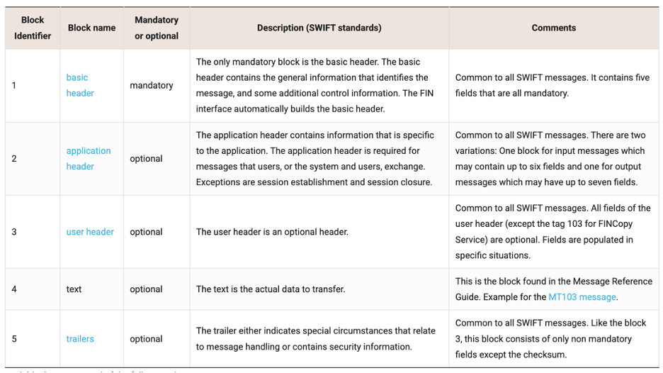
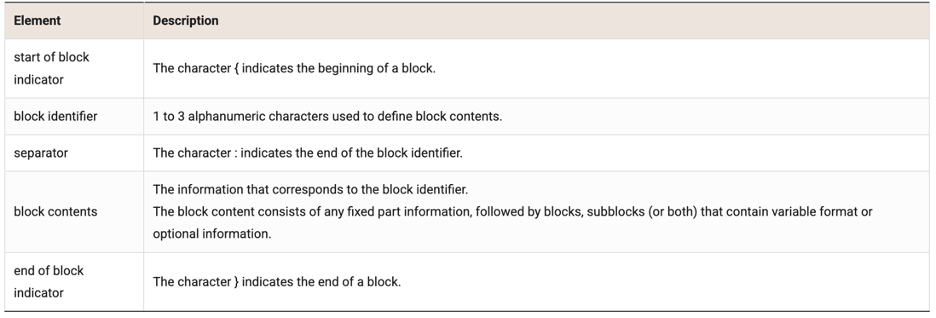
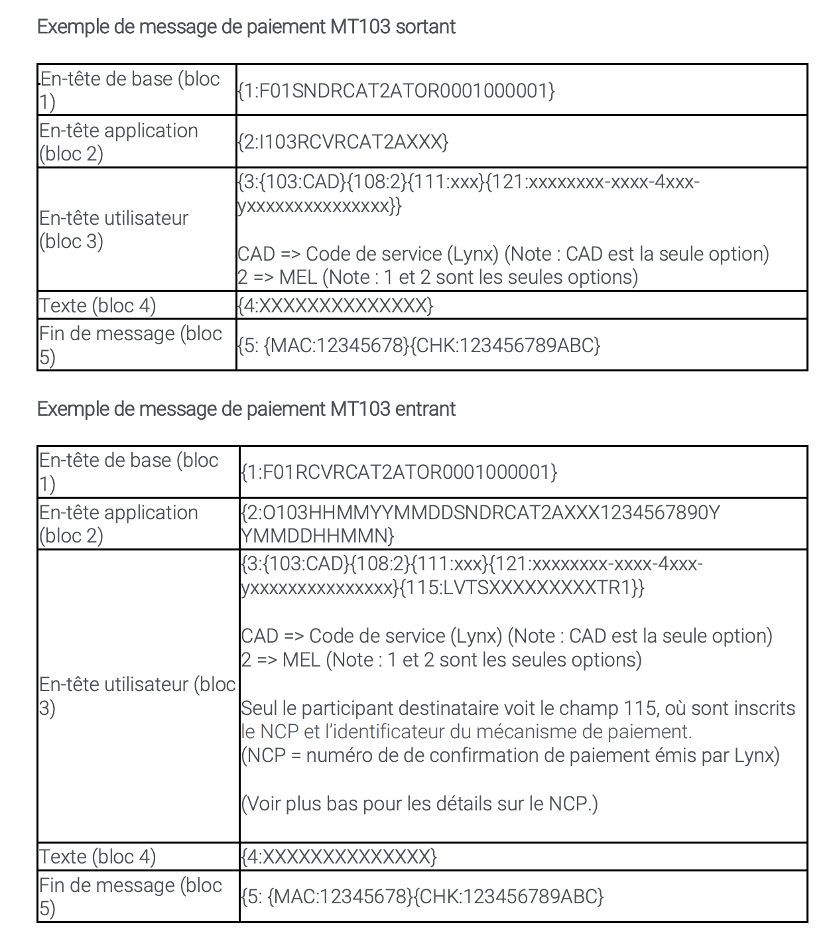
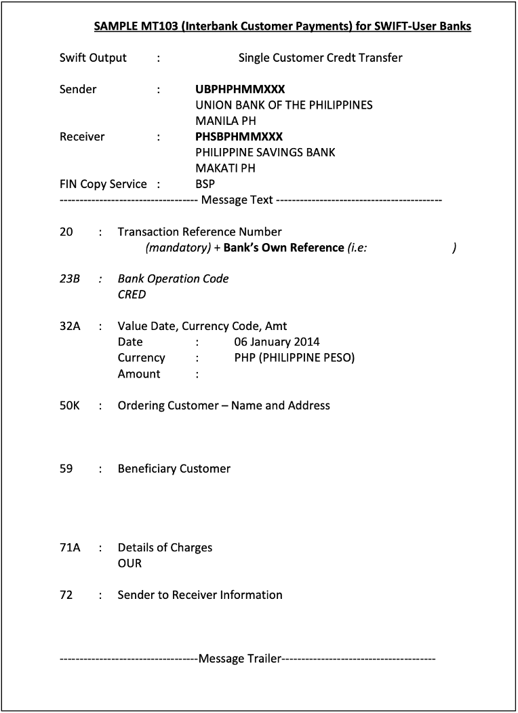

___
#   
RAPPORT DE DOCUMENTATION

___
##   
 Messages SWIFT et Norme ISO 20022

#### 
Présenté à Directeur de Projet Yassine Elghazouani

#### 
Rédigé par Salma Yousry le 4 juillet 2025

#### 
Attijariwafa Bank

___

### 
TABLE DES MATIÈRES 

---

[Introduction](#Introduction)

* [SWIFT](#SWIFT)

* [Messages Types](#message-types---mt)

  * [Messages MT103](#messages-mt103)

* [Norme ISO 20022](#norme-iso-20022)

  * [Structure XML](#structure-xml)

  * [Actualité](#actualité)

* [Norme CBPR+](#la-norme-cbpr)

* [Messages pacs.008](#pacs-008)

[Conclusion](#conclusion)

[Annexe](#centerannexecenter)

* [Répertoire de MT SWIFT](#répertoire-de-mt-swift)

[Bibliographie](#centerbibliographiecenter)

___

### INTRODUCTION
Ce document présente les principaux formats de messagerie utilisés dans les opérations bancaires, particulièrement dans le réseau SWIFT. Il aborde la structure des messages MT, leur classification par typologie fonctionnelle, ainsi que les éléments spécifiques du message MT103.
En deuxième lieu, la norme ISO 20022 est décrite, suivie par la norme CBPR+ et ses spécificités. Les différences entre les deux standards y sont expliquées, ainsi que les caractéristiques du message PACS.008. L’objectif est de fournir une base claire pour comprendre les principaux standards de communication interbancaire utilisés dans les systèmes de paiement actuels.

### SWIFT
Active depuis 1977, la SWIFT est une coopérative internationale permettant de regrouper des institutions bancaires. Elle offre une infrastructure de messagerie sécurisée, permettant aux banques de partager et échanger des informations transactionnelles telles que des instructions de change et confirmations et détails de transactions. Son système principal, SWIFTnet, est désormais utilisé par plus de 11 000 institutions réparties dans plus de 200 pays et transmet près de 44 millions de messages quotidiennement. Toutes les institutions bancaires membres du réseau possèdent un code unique, le BIC (Bank Identifier Code), qui permet de les identifier dans le système. Un virement international invoque une séquence de messages SWIFT entre les banques concernées. Ces messages regroupent des données sur le montant, le donneur d’ordre et bénéficiaire, etc.

### MESSAGE TYPES - MT
#### Fonctionnement et Structure
Les Messages Type (MT) sont les messages standardisés utilisés dans la 
SWIFT. Un MT est identifié à l’aide d’un code à trois chiffres. 
Le premier indique la catégorie ou type d’opération concerné, le deuxième
le groupe de parties liées au cycle de vie d’une transaction, et le
troisième le type de message. Ainsi, il existe des centaines de types 
de messages différents sur l’ensemble des catégories .  Ces messages 
sont structurés en blocs  regroupant chacun des informations spécifiques.

#### Typologie des Messages MT
Les messages MT sont répartis en catégories fonctionnelles selon leur 
utilié. Chaque catégorie contient des messages qui partagent une logique métier. Par exemple, le MT103 est 
utilisé pour un virement client classique, tandis que le MT202 est utilisé pour les transferts entre 
institutions financières.

#### Messages MT103
Le MT103 est un message SWIFT standardisé utilisé pour transmettre les instructions de paiement dans le cadre de transferts internationaux de fonds entre clients. Il permet aux banques d’effectuer un virement au nom d’un client, avec toutes les informations nécessaires pour exécuter l’opération. Le message MT103 contient les informations essentielles à l’exécution d’un virement international client à client. Il inclut notamment une référence de transaction (:20:), la date, devise et montant du paiement (:32A:), l’identité du donneur d’ordre (:50K:) ainsi que celle du bénéficiaire (:59:), sans oublier les modalités de frais (:71A:). Ce format standardisé permet aux banques d’interpréter automatiquement les instructions de paiement .

### NORME ISO 20022
La norme ISO 20022 est un langage international pour les messages financiers, conçu pour remplacer
les anciens formats MT.

#### Avantages
Contrairement aux messages MT en texte brut, les messages ISO 20022 sont basés sur le format XML, 
ce qui permet une structure détaillée, cohérente et lisible par machine. Ce standard offre une meilleure 
qualité de données, de meilleures traçabilité et compatibilité entre les institutions financières. Il permet
par exemple de transmettre des informations détaillées sur le donneur d’ordre, le bénéficiaire, la raison du
paiement, les intermédiaires et les taxes/frais.

#### Structure XML
La norme ISO 20022 repose sur une structure XML hiérarchique, où chaque élément du message est encadré par des balises 
normalisées. Cette structure permet de décrire avec précision les différentes composantes d’une transaction, telles que le montant, 
les identités du donneur d’ordre et du bénéficiaire, la devise, la date d’exécution, etc. Le message est organisé en blocs principaux comme le « Group Header» 
(informations générales sur le message) et le « Credit Transfer Transaction Information » (détails de la transaction).

#### Actualité
Depuis mars 2023, SWIFT a lancé la phase de coexistence entre les formats MT et ISO 20022, 
prévue jusqu’à novembre 2025. De nombreuses grandes institutions bancaires et banques centrales ont déjà adopté
ISO 20022 pour les paiements de gros montants et les infrastructures de marché. Selon SWIFT, plus de 80 % des
volumes de paiements mondiaux en valeur seront traités avec ISO 20022 d’ici la fin de 2025.

### LA NORME CBPR+
CBPR+ (Cross-Border Payments and Reporting Plus) est une initiative lancée par SWIFT dans le cadre
de la transition vers la norme ISO 20022. Elle vise à définir des règles d’utilisation standardisées pour
appliquer les messages ISO dans le contexte des paiements internationaux interbancaires.

#### Objectif
L’objectif principal de CBPR+ est de permettre une transition fluide entre les anciens formats MT (comme le MT103) et les
nouveaux messages ISO (eg. pacs.008), 
tout en assurant une interopérabilité maximale entre les institutions financières internationalement. CBPR+ fournit une 
base pour garantir la cohérence, lisibilité et compatibilité des messages ISO sur le réseau SWIFT.
Pour chaque type de message ISO, CBPR+ définit les champs obligatoires, optionnels, exclus ou conditionnels, 
ainsi que des restrictions de format ou de contenu spécifiques.
Dans la migration actuelle vers ISO 20022, CBPR+ joue un rôle important en encadrant l’adoption des nouveaux 
formats sur le réseau SWIFT.

#### Outil de Transition
Depuis mars 2023, les institutions utilisent CBPR+ pendant la période de « coexistence », qui se poursuivra jusqu’en novembre 
2025, date à laquelle les formats MT ne seront plus supportés pour les paiements transfrontaliers.

### PACS 008
PACS.008 est le message ISO 20022 équivalent au MT103 dans le système SWIFT. 
Il est utilisé pour les transferts de fonds entre clients, généralement dans un contexte 
interbancaire international. Contrairement au MT103, le PACS.008 repose sur une structure XML standardisée permettant d’intégrer 
un volume de données plus précis et lisible par des systèmes automatisés.

#### Contenu
- Identification de la transaction
- Donneur d’ordre et le bénéficiaire
- Montants, devises, dates, références
- Intermédiaires bancaires (le cas échéant)
- Informations sur les frais, motifs de paiement, taxes, etc.

Grâce à cette structure et granularité, le PACS.008 facilite la conformité réglementaire, la détection de fraudes et 
l’interopérabilité entre systèmes financiers dans le monde entier.

### CONCLUSION
Le réseau SWIFT constitue l’infrastructure principale permettant l’échange sécurisé de messages financiers entre institutions 
bancaires dans le monde entier. Il repose sur un système de messagerie structuré, dans lequel les messages MT assurent le 
traitement d'opérations variées comme les paiements, transferts interbancaires ou opérations de change. Les messages MT 
sont codifiés par catégories fonctionnelles et organisés en blocs, avec des balises normalisées facilitant leur lecture 
automatisée. Le MT103, utilisé pour les virements client à client, illustre ce format historique largement adopté. La norme 
ISO 20022 apporte une structure XML plus détaillée, mieux adaptée aux exigences actuelles en matière de conformité, d’automatisation 
et d’enrichissement des données. La norme CBPR+ assure une transition fluide entre SWIFT et ISO, prévue d’être complète sous peu. 
Le message PACS.008, équivalent du MT103, illustre cette évolution en intégrant une granularité et compatibilité renforcées entre systèmes. 
Déjà commencée dans de nombreuses institutions, la transition vers ISO 20022 marque une étape clé dans la transformation des infrastructures 
de paiement internationales.

___

## 
ANNEXE

##### Structure des messages SWIFT

_https://www.paiementor.com/swift-mt-message-structure-blocks-1-to-5/_

##### Exemples de message MT103 standarisé
1.

2.

##### Répertoire de MT SWIFT

| Catégorie | Usage principal        | Exemples (communs) |
|-----------|------------------------|--------------------|
| MT1**     | Paiements client à client | MT103, MT199       |
| MT2**     | Transferts interbancaires | MT202, MT299       |
| MT3**     | Opérations de change   | MT300, MT320       |
| MT4**     | Encaissements et recouvrements | MT400, MT410       |
| MT5**     |   Titres et opérations sur valeurs | 	MT540, MT550      |
| MT7**     | Crédits documentaires  | MT700, MT799       |
| MT9**     | Trésorerie / Relevés  | MT910, Mt940       |

Liste complète : https://www.paiementor.com/list-of-all-swift-messages-types/

___

## 
BIBLIOGRAPHIE

BNY, M. « ISO 20022 Learning Guide - Module 4: pacs.008 Customer Credit Transfer », 2022,
https://www.bnymellon.com/content/dam/bnymellon/documents/pdf/iso-20022/learning-guide-module-4.pdf
Page consultée le 4 juillet 2025.

FINBUS. n.d. « CBPR+ SWIFT Consultancy », 2023,
https://finbus.com/index.php/swift-consultancy-2/cbpr/
Page consultée le 4 juillet 2025.

ISO 20022 Payments. n.d. « What Is CBPR+? », 2023,
https://www.iso20022payments.com/cbpr/what-is-cbpr/
Page consultée le 4 juillet 2025.

KAGAN, J. et Al.,  «Society for Worldwide Interbank Financial Telecom. (SWIFT)», 2023,
Investopia, https://www.investopedia.com/terms/s/swift.asp
Page consultée le 3 juillet 2025.

PAIEMENTOR. n.d. «List of All SWIFT Messages Types», 2020, Thiais, France
https://www.paiementor.com/list-of-all-swift-messages-types/
Page consultée le 4 juillet 2025.

PAIEMENTOR. n.d. «SWIFT MT Message Structure: Blocks 1 to 5», 2020, Thiais, France
https://www.paiementor.com/swift-mt-message-structure-blocks-1-to-5/
Page consultée le 3 juillet 2025.

SKYDO. n.d. «MT103: What Is It, Why It Matters, and How to Get One».
https://www.skydo.com/blog/mt103-what-is-it-why-it-matters-and-how-to-get-one
Page consultée le 3 juillet 2025.

STATRYS. n.d. «What Is an MT103 and Why It’s Important», 2025.
https://statrys.com/blog/mt103-documents
Page consultée le 3 juillet 2025.

SWIFT.ORG, «About ISO 20022», 2025. La Hulpe, Belgique
https://www.swift.com/fr/node/301036
Page consultée le 4 juillet 2025.

SWIFT. 2023. « Cross-Border Payments and Reporting Plus (CBPR+) »,
https://www.swift.com/standards/iso-20022/cbpr
Page consultée le 4 juillet 2025.

TIBCO, « MT Message ».  2021,
https://docs.tibco.com/pub/bwpluginswift/6.6.0/doc/html/GUID-9F124717-19E8-46A5-82BB-830ABCD94D48.html
Page consultée le 3 juillet 2025.

___